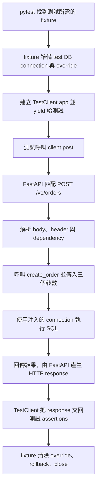

# 工程難題紀錄

只記錄實作時真正卡住、且日後值得重用的問題。所有日期共用這一份檔案，不必每天新增文件。

## 紀錄格式

```text
## YYYY-MM-DD — 問題名稱
- 現象：看到什麼錯誤
- 原因：真正的根因
- 解法：最後採用的做法
- 驗證：如何證明已解決
```

## 2026-08-13 — PostgreSQL constraint 測試的 rollback 迴圈

- 現象：預期中的 SQL constraint 錯誤發生後，同一 transaction 再執行 `SELECT` 會得到 `InFailedSqlTransaction`。
- 原因：PostgreSQL statement 失敗後，transaction 會進入 aborted 狀態；必須 rollback 才能繼續使用。但 rollback 後再查不到資料，只能證明 transaction 被撤銷，不能單獨證明 constraint 正確。
- 解法：
  - 負向測試用 try/except/else做條件式區分，錯誤直接被except抓到，若意外正確則去讀table,並用assert卡死。
  - 正向測試：INSERT合法資料後SELECT查回並assert預期值；若發生未預期例外，測試直接失敗。pytest.raises用於預期應拋例外的負向案例，不是正向成功的通用流程。（9/10按現有tests修正原敘述。）
  - Session fixture 只在整套測試開始前清空一次，每個測試仍自行 rollback／close。
- 驗證：完整測試 `7 passed`，Ruff 通過，測試後 `accounts` 表為 0 筆。

## 2026-08-20 — 理解 Pytest fixture 如何把 TestClient 傳進測試

- 現象：程式已經寫成 `test_existing_account(Test_database_connection)`，request 也已正確使用 `Test_database_connection.get(...)`，但仍不清楚 fixture 是否需要手動呼叫，以及 `yield test_client` 為什麼會變成測試函式中的 `Test_database_connection`。
- 原因：Pytest 不是依一般函式呼叫流程執行 fixture，而是先查看測試函式需要哪些參數。當它看到參數名稱 `Test_database_connection`，便自動尋找並執行同名的 `@pytest.fixture`。fixture 執行到 `yield test_client` 時會暫停，並把該 `test_client` 物件注入同名測試參數；因此測試中的 `Test_database_connection` 實際上就是可呼叫 `.get(...)` 的 `TestClient`。

## 2026-08-24 — Fixture 內的 FastAPI dependency override

- 現象：`get_test_account_connection` 定義在 `order_api_client` fixture 裡，因此不清楚 test 要如何 import／呼叫它；也不理解 production route 已經寫了 `Depends(get_account_connection)`，為什麼測試仍要在 `dependency_overrides` 中再次寫出 `get_account_connection`。
- 原因：
  - Test function 不會直接呼叫 `get_test_account_connection`。Pytest 先執行 `order_api_client` fixture；fixture 在 `yield client` 暫停期間仍然存活，而 nested function 透過 closure 保留同一條 test database connection。
  - `app.dependency_overrides` 是一個 dictionary，不是單一 dependency 欄位。FastAPI route 已保存原 production callable；測試必須以該 callable 作為 key，才能指出要替換哪一個 dependency。單純在 test module 重新指定同名變數，不會改掉 route 已保存的 reference。
- 解法：在 fixture 內定義 replacement dependency，將 function object（不加 `()`）登記到 override mapping，再由 FastAPI 於 request 時呼叫：

  ```python
  def get_test_account_connection():
      yield connection

  app.dependency_overrides[get_account_connection] = (
      get_test_account_connection
  )
  ```

  Test function 只接收 fixture `yield` 出來的 `TestClient`，並用 `.post(...)`／`.get(...)` 發 request；cleanup 時移除原 dependency 對應的 override，再 rollback／close test connection。
- 驗證：目前已釐清 fixture、closure 與 override mapping 的責任邊界；當時的RED／collection checkpoint已完成；9/10現行order API可收集13 cases，fixture仍提供同一條test connection，已完成案例不重開。

## 2026-08-24 — Fixture 與 runtime `order_id` 的產生責任

- 現象：`order_api_client` fixture 只 INSERT 測試帳戶，沒有建立 `order_id`，但 `test_create_limit_buy_order` 又要求成功 response 包含 `order_id`，因此不清楚這個 ID 應在何時、由誰產生。
- 原因：fixture 準備的是下單前已存在的 prerequisite state，例如 account 與 test connection；此時 order 尚未建立，所以 fixture 不應預先產生 order identity。`order_id` 是 POST 成功建立新 order 時才出現的 resource identity，屬於 runtime application behavior。當時實作仍要求client提供order_id，屬當時未完成狀態；9/10核對現行request model不含order_id，由create_order生成並保存／回傳，已解決。
- 目標解法：test request 與 request model 只描述 client-owned command fields；由create_order產生server-owned order_id供新單INSERT。現行source在transaction前先生成UUID；重播分支使用保存的response，不使用新生成值；生成時間不等於訂單成立時間。同一個值必須寫入 `orders.order_id`、放入成功 response，並供後續 `GET /v1/orders/{order_id}` 使用；未來 same-key replay 必須回傳已保存的同一 ID，不能重新產生。
- 已解決：現行CreateOrderRequest不含order_id，INSERT及response共用server ID，same-key replay回保存結果；既有BUY與重播tests已驗收，9/10重新核對source，不重開此關。

## 2026-08-24 — `server-owned` 是責任，不是 `server.py` 檔名

- 現象：看到「`order_id` 由 server 產生」時，容易理解成未來必須建立一個 `server.py`，再把 ID generation 放進該檔案。
- 原因：`server` 描述的是可信後端的執行角色與 ownership，不是 Python 專案規定的檔名。只要程式是在 FastAPI backend process 中執行，而不是由 client request 提供結果值，就屬於 server-side behavior。
- 目前責任分工：
  - `app/main.py` 建立 FastAPI app 並掛載 routers。
  - `app/routers/orders.py` 接收 order command；其中的 `create_order()` 是目前執行 order 建立流程的 server-side handler。
  - Uvicorn 啟動並承載 FastAPI app，不負責 order business identity。
  - PostgreSQL 保存 handler 產生的 `order_id` 與 order state。
- Data path：`client／TestClient -> app/main.py -> app/routers/orders.py:create_order -> PostgreSQL`。因此現在由 `create_order()` 在 runtime 產生 ID，就已符合 server-owned，不需要新增 `server.py`。
- 架構邊界：未來如果 idempotency、locking、cash reservation、order、transition 與 outbox transaction 讓 route 過度複雜，可以再把 business flow 抽到 service layer；這是 complexity/責任分離的決策，不是因為看到 `server-owned` 就先建立 `server.py`。
- 驗證：目前已釐清角色與檔案邊界，未新增無需求的 `server.py`；runtime order_id ownership已由既有API tests、DB row與response共用ID的證據確認；9/10核對source，這不是新待辦。

## 2026-08-25 — TestClient POST 的 request 與 response 邊界

- 現象：看到 `response = client.post(url, headers=..., json=...)` 時，容易因為 `.post(...)` 正在送 request，就把左邊的 `response` 或 `response.json()` 也誤認成 request 資料。
- 原因：同一行包含兩個方向。`.post(...)` 括號內的 URL、headers 與 `json=...` 是 client 準備送給 server 的 request；method 執行完成後，回傳的是 server 的 HTTP response，並由左邊的 `response` 變數接住。`POST` 和 `GET` 都是 request method，兩者執行後都會得到 response。
- 解法：如果 test 後續仍要使用送出的 JSON，先把它命名，再將同一個變數交給 `json=`；不要用 `response.json()` 反查 request：

  ```python
  request_json = {"example_field": "example_value"}
  response = client.post("/example", json=request_json)
  ```

  `request_json` 是送出的 request 資料；`response` 是 server 回覆的 HTTP wrapper；`response.json()` 只解析 response body。
- 驗證：從右到左閱讀 `response = client.post(...)`：先以括號內參數建立 POST request，server 處理後回傳 response，再指定給左邊變數。request 與 response 可能包含相同欄位，但不是同一份 JSON，也不能因欄位名稱相同就混用。

## 2026-08-29 — psycopg `Jsonb` 是寫入 adapter，不是查回值

- 現象：`request_payload` 已經是 request dictionary 裡的 nested dictionary，因此不清楚應該把 `Jsonb(...)` 放進 request、只在 INSERT 時包裝，還是查回後用 `row["request_payload"] == Jsonb(...)` 比較。
- 原因：Python application data、psycopg adapter 與 PostgreSQL JSONB 是三個不同責任層。程式內的 payload 保持普通 `dict`；`Jsonb(dict)` 只是 psycopg 在 SQL 寫入邊界使用的序列化／型別 adapter，不是 application payload 本身。PostgreSQL JSONB 經 psycopg SELECT/fetch 後，通常已解碼回 Python `dict`。
- 解法：
  - request dictionary 內保存普通 nested `dict`，不要預先保存 `Jsonb(...)`。
  - 只有把 payload 當作 INSERT parameter 時才呼叫 `Jsonb(payload)`。
  - 查回 JSONB 後，直接把 row 中的 Python `dict` 與原始 payload `dict` 比較；不要再建立一個 `Jsonb(...)` adapter 參與 assertion。
  - 要寫入 SQL `NULL` 時，直接把 Python `None` 當作 SQL parameter；不要使用 `Jsonb(None)`。
  - `Jsonb(None)` 會寫入「JSONB 型別內的 `null` 值」，該欄位本身仍然有值，因此 PostgreSQL 的 `column IS NULL` 會判定為 false。這和 SQL `NULL` 表示整個欄位沒有值不同。
  - 當 JSONB response body 可有可無時，應先在 Python 邊界判斷：沒有 body 就傳 `None`，有 body 才用 `Jsonb(...)`。否則依賴 `response_body IS NULL` 的配對 constraint 可能得到錯誤語意。

  ```python
  report_request = {
      "job_key": "REPORT-001",
      "input_payload": {"report_type": "monthly", "year": 2026},
  }

  cursor.execute(
      "INSERT INTO report_jobs (job_key, input_payload) VALUES (%s, %s)",
      (
          report_request["job_key"],
          Jsonb(report_request["input_payload"]),
      ),
  )

  assert row["input_payload"] == report_request["input_payload"]
  ```

  不同主題的 optional JSONB 寫入範例：

  ```python
  report_result_body = None

  database_result_body = (
      None
      if report_result_body is None
      else Jsonb(report_result_body)
  )
  ```

  此時 `database_result_body` 為 `None`，psycopg 會送出 SQL `NULL`；若 `report_result_body` 是 dictionary，才會經由 `Jsonb(...)` 寫成 JSONB object。

- 資料流：`Python dict -> INSERT時Jsonb(dict) -> PostgreSQL JSONB -> SELECT/fetch -> Python dict`。
- NULL 邊界：`Python None -> SQL NULL`；`Jsonb(None) -> PostgreSQL JSONB null`。兩者不能互換。
- 驗證：概念與 assertion 邊界已釐清；當時pending constraint checkpoint已完成；現行tests/test_idempotency_constraints.py涵蓋SQL NULL配對等契約並有既有驗收。9/10僅核對source/collection，不把此歷史待辦重開。

## 2026-08-31 — psycopg 單一參數必須使用 one-item tuple

- 現象：SQL 只有一個 `%s` 時，把參數寫成 `("SIM-001")` 或 `cursor.execute(sql, ("SIM-001"),)`，psycopg 仍可能回報「query parameters should be a sequence or a mapping, got str」。
- 原因：Python 的括號只負責分組，不會自行建立 tuple；真正建立 tuple 的是逗號。因此 `("SIM-001")` 仍是 `str`，`("SIM-001",)` 才是含一個元素的 tuple。`cursor.execute(sql, ("SIM-001"),)` 最外層的逗號只是 function call 的 trailing comma，並不會跑進內層括號把字串變成 tuple。
- 解法：一個 placeholder 使用 one-item tuple，逗號必須放在元素與內層右括號之間：

  ```python
  cursor.execute(
      "INSERT INTO report_jobs (job_key) VALUES (%s)",
      ("REPORT-001",),
  )
  ```

  兩個以上元素本來就由元素之間的逗號形成 tuple，最後一個 trailing comma 可有可無：

  ```python
  ("REPORT-001", 200)
  ("REPORT-001", 200,)
  ```

  以上兩種都是二元素 tuple。多行格式通常保留最後逗號，方便新增元素與產生乾淨的 Git diff。
- 快速驗證：`type(("SIM-001")) is str`，而 `type(("SIM-001",)) is tuple`。傳給 psycopg 的 tuple 元素數量仍必須和 SQL `%s` placeholder 數量一致。

## 2026-09-05 — test_orders_api.py 如何把 request 傳進 orders.py

- 現象：測試只寫 `order_api_client.post(...)`，沒有直接呼叫 `create_order(...)`，因此不清楚 request 最後由誰傳入 route，以及 fixture、app、connection 各自扮演什麼角色。
- 核心概念：測試把 method、URL、headers、JSON body 交給 TestClient；TestClient 呼叫它持有的 FastAPI app，再由 FastAPI 找到 handler、準備參數並呼叫 `create_order()`。真正呼叫 handler 的程式在 framework 裡。
- 名稱對照：本專案實際檔案是 `tests/test_orders_api.py` 與 `app/routers/orders.py`。FastAPI 用 HTTP method 與 URL path 選 handler；檔名不是 URL。

### 一次 request 的完整路徑



1. **pytest 先取得 fixture，才執行測試本體。**

   [test_orders_api.py:56](../tests/test_orders_api.py#L56) 的 `test_create_limit_buy_order(order_api_client)` 宣告需要 `order_api_client`。pytest 依參數名稱找到同名 `@pytest.fixture`，執行至 `yield client`，再把這個 client 交給測試。因此測試裡的 `order_api_client` 是 TestClient 物件，不是要手動呼叫的 fixture function。

2. **fixture 把 client 與測試 connection 接到同一個 app。**

   [test_orders_api.py:35](../tests/test_orders_api.py#L35) 的 fixture 先連到設定中的 test database、檢查資料庫名稱以 `_test` 結尾並準備測試帳戶，再登記：

   ```python
   app.dependency_overrides[get_account_connection] = get_test_account_connection
   ```

   左邊的 key 是 route 原本引用的 dependency function object；右邊是替代 function object，兩邊都沒有加 `()`。登記本身不會執行替代函式，FastAPI 在處理 request 的 dependency 時才會使用它。內層函式透過 closure 保留 fixture 建立的 connection。

   同一個 fixture 隨後用 `TestClient(app)` 建立 client；這個 `app` 就是 `from app.main import app` 匯入的物件。

3. **`client.post(...)` 組成 request，左邊的變數接收 response。**

   在現有測試中，`"/v1/orders"` 是 URL path，`headers={"Idempotency-Key": ...}` 是 HTTP header，`json={...}` 是 request body 的資料來源。TestClient 將 JSON 編碼成 request body，再透過內部 ASGI transport 呼叫 app。

   這段 HTTP 測試不需要另開 Uvicorn 或 HTTP listening port；它仍會執行實際的 routing、validation、handler 與資料庫 SQL。PostgreSQL connection 是 fixture 真正建立的連線，並沒有因為使用 TestClient 就變成假的資料庫。

   `response = client.post(...)` 會等 app 回覆後才取得 response；`response.json()` 解析的是回覆的 body。

4. **app 的 route registration 決定 request 交給哪個函式。**

   [main.py:8](../app/main.py#L8) 註冊 `app.include_router(orders.router, prefix="/v1/orders")`；[orders.py:25](../app/routers/orders.py#L25) 用 `@router.post("")` 將 `create_order()` 登記為 POST handler。

   因此完整匹配是：`POST` ＋ `"/v1/orders"` ＋ `""` → `create_order()`。`main.py` 在 app 建立時做註冊，不是每次 request 都重新讀取並執行一次該檔案。測試也不需要 import 或直接呼叫 `create_order()`。

5. **FastAPI 根據函式宣告，準備三個不同來源的參數。**

   | `create_order()` 參數 | 來源 | 在 handler 裡拿到什麼 |
   |---|---|---|
   | `order: CreateOrderRequest` | request JSON body | 經 Pydantic 解析／驗證的 model；例如 JSON 的 price 字串會依宣告轉成 `Decimal` |
   | `idempotency_key` | `Header(alias="Idempotency-Key")` 指定的 HTTP header | 對應 header 的字串值 |
   | `connection` | `Depends(get_account_connection)`，測試時依 override 改用替代函式 | fixture 建立的同一條 psycopg test connection |

   可以把 framework 的交接理解成「準備好 model、header 值與 connection，再呼叫 `create_order(order=..., idempotency_key=..., connection=...)`」。這是流程說明，測試不需要再補這行呼叫。connection 由伺服器端 dependency 提供，不會放進 request JSON 或 header。

   Body／header 驗證不通過時，FastAPI 會回 validation error，通常為 422，而不執行 `create_order()` 的業務本體。這不表示 dependency 一定完全沒有執行；不要把它理解成所有解析都有固定的先後順序。

6. **route 使用 connection，然後結果沿原路回到測試。**

   [orders.py:41](../app/routers/orders.py#L41) 開始把 model 轉成 request payload，並在 transaction 中執行 SQL。成功路徑回傳 `response_body`，FastAPI 依 route 設定產生 201 與 JSON response；TestClient 將 response 物件交回測試，後面的 status／body assertions 才開始執行。

   `HTTPException` 會由 framework 轉成對應的 HTTP 錯誤回覆；未處理的程式／資料庫例外，在目前 TestClient 的預設設定下可能直接拋到測試。因此過去看見 psycopg traceback，是 request 已進入 route 後失敗的證據。

7. **測試結束後，fixture 才繼續清理。**

   外層 fixture 的 `yield client` 讓 setup 與 cleanup 分開：測試跑完或 assertion 失敗後，fixture 進入 `finally`，清除 overrides，再 rollback 與 close connection。

   [database.py:8](../app/database.py#L8) 的原始 dependency 會自行建立一般環境 connection；目前 API 測試以 override 替代它，因此 route 和測試查詢使用 fixture 的 connection。這也解釋了為什麼 route 看得到 fixture 尚未 commit 的帳戶，以及測試可以查回 route 寫入的 transition。

### 兩層 yield 不要混在一起

| 位置 | 把什麼交給誰 | 生命週期 |
|---|---|---|
| 外層 `order_api_client` fixture 的 `yield client` | pytest 把 client 交給 test function | 單一測試的 setup／teardown |
| 外層 `order_api_client_and_connection` 的 `yield client, connection` | pytest 把 tuple 交給測試，再由測試拆成兩個變數 | 讓測試同時發 request、查同一條 DB connection |
| 內層 `get_test_account_connection` 的 `yield connection` | FastAPI 把 connection 注入 route | dependency 的 request 生命週期；這裡的 connection 由外層 fixture 統一清理 |

測試 fixture 的帳戶 INSERT 已開啟 transaction，因此目前 route 的 `connection.transaction()` 在這條連線上使用巢狀 savepoint。route 成功退出這一層，不等於 fixture 的外層 transaction 已永久 commit；最後 rollback 仍會撤銷測試資料。這段證據能確認 request 流程與同連線資料狀態，跨連線可見性／真正 commit 的完整驗收要另外證明。

- 驗證：2026-09-05 重新讀取上述四個專案檔案與本機 Starlette TestClient transport，並以不連 DB 的 OpenAPI／callable identity 檢查確認：`POST /v1/orders` 對應 `create_order`、body schema 是 `CreateOrderRequest`、header 為 `Idempotency-Key`、有 201 response、override key 與 route 引用同一個 dependency callable。本 task 前一回合的五個 API targets 與 payload／response probe 均通過。
- 記錄邊界：這一節更新的是現行流程說明；前面的日期條目保留當時歷史。寫入解說與測試通過不代表 Andrew 已完成閉卷理解驗收。既有「整個 Mini Project 完成後回顧 order_api_client」待辦維持原狀，本次沒有新增口試或改變 outbox active task。

## 2026-09-07 — Idempotency 的用途，以及測試何時自行 INSERT

- 問題：不清楚 idempotency 是什麼，以及為什麼 rollback 測試不先自行 INSERT `idempotency_requests`。
- 核心概念：idempotency（冪等性）讓同一個邏輯請求重送時，不會重複產生下單效果。`Idempotency-Key` 是辨識這次邏輯請求的標記；`idempotency_requests` 保存對應輸入與已完成結果，讓伺服器判斷是否已成功處理。

### 為什麼下單需要它？

1. Client 帶著 key `abc` 送出買單。
2. 伺服器成功建立訂單 `O1`，預留現金，並保存 `abc` 對應的 request payload、成功 status 與 response body。
3. 回應途中斷線，client 不知道是否成功，因此用相同 key 與相同 payload 重送。
4. 伺服器查到既有成功結果，回傳原本 `O1` 的回應，不再建立 `O2` 或預留第二次現金。

依本專案 2026-09-07 核准契約，只保留成功 `201`。新 key 的未知帳戶 `404`、不足資金 `409`、格式錯誤 `422` 不留下 pending／completed 紀錄，所以條件修正後可重試。已有成功紀錄時，相同 key／相同 payload 重播原結果；相同 key／不同 payload 回衝突 `409`，保留原成功紀錄。這是目前的目標行為說明，不是額外宣稱併發與完整原子性已通過驗收。

### 不是不能 INSERT，而是先 INSERT 代表不同測試前提

自行 INSERT 的意思是：「發出這次 POST 以前，這個 key 的紀錄就已經存在。」因此 route 可能走既有 key 的 replay／conflict 路徑，而不是這次要驗證的新訂單寫入路徑。

| 要測什麼 | 誰建立 idempotency 紀錄？ |
|---|---|
| 正常下單會建立紀錄 | 由 POST 呼叫的 route 建立。 |
| 下單中途失敗，剛建立的紀錄會撤銷 | 由這次 POST 建立，失敗後查證它已撤銷。 |
| 已有成功紀錄時是否 replay／conflict | 可以自行 INSERT 完整合法的成功紀錄作為前提，也可以先 POST 成功一次。 |
| 資料表的 PK、CHECK 等限制 | 直接 INSERT 合法／非法資料，驗證 DB 是否接受或拒絕。 |
| 既有 pending 狀態的處理 | 可以刻意 INSERT pending，但那是另一個需要明確契約的測試情境。 |

帳戶是這次下單前必須存在的資料，所以由 fixture 準備；本次請求的 idempotency 紀錄是 route 執行時建立的資料，所以交給 POST 建立。這個分工由測試目的決定，不是禁止測試直接寫資料庫。

### 套用到目前 outbox 失敗的 rollback 測試

```text
fixture 建立帳戶
→ SELECT 記下 cash 與各表原本筆數
→ POST 新 key 的合法買單
→ route INSERT idempotency、預留現金、建立 order 與 transition
→ 測試刻意讓 outbox INSERT 失敗
→ 用原 connection 再 SELECT，比較是否回到請求前狀態
```

- POST 前只需傳好 `Idempotency-Key` header，不自行 INSERT 這次請求的 idempotency 紀錄。
- 先 INSERT 相同 key，會改變 route 的執行分支；先 INSERT 不同 key，則只是新增既有資料，不能用它證明本次 POST 的紀錄有被撤銷。
- 不預設所有表原本都是零筆；記下基準，再確認失敗後 cash 與筆數都等於基準。
- 比較必須在 fixture teardown 前完成。fixture 最後的 rollback 是測試清理，不能拿它取代 route 本身 transaction 的 rollback 證據。

- 錯誤類別：概念／測試前提與被測行為的區分。
- 記錄來源：本次 side conversation 的三輪解說與 Andrew 明確授權寫入筆記；僅保存解說，不修改程式、測試或主線進度，也不把閱讀筆記當成驗收通過。

## 2026-09-09 — SQL 執行、commit、rollback 與測試清理的責任

本節整理 Day3 最後問答的正確觀念，補充前面 2026-09-05 的 fixture 流程與 2026-09-07 的 idempotency 筆記。錯誤類別：概念／SQL 執行與提交、業務歷史與資料庫交易、程式驗證與測試清理的區分。

### 1. SQL 已執行，不等於交易已 commit

| 動作 | 意義 |
|---|---|
| `execute(UPDATE / INSERT ...)` | SQL 送到 PostgreSQL 執行；成功後，本交易已產生相應變更。 |
| `commit` | 正式提交整筆交易，保留其變更。 |
| `rollback` | 撤銷本交易尚未提交的變更，保留交易開始前已有的資料。 |

**「沒 commit」不等於「沒送到 DB」。** 題目若說帳戶已扣款，代表前面的 UPDATE 已在 DB 執行；只是整筆交易還沒正式提交。一般其他連線不會讀到這些未提交的新值，但本交易可以讀到自己的變更。

以一筆尚未提交的轉帳為例：

```text
原本：A = 1000，B = 500
→ 同一交易內，A 扣 200 成功：A 暫為 800
→ B 入帳時失敗
→ 例外離開 transaction 區塊，觸發 rollback
→ 回到 A = 1000，B = 500
```

不是重新 INSERT 一份備份，也不是整個資料庫歸零；撤回的是這次交易的變更。

### 2. 回滾由 transaction 負責，不依賴業務歷史表

目前 [orders.py:46](../app/routers/orders.py#L46) 使用 `with connection.transaction():`。例外離開區塊時，Psycopg 透過 PostgreSQL 的交易機制回滾這個區塊的變更。即使失敗發生在建立 `orders` 時、尚未建立任何 transition，也能撤回先前增加的預留款。

| 機制／資料表 | 責任 |
|---|---|
| transaction | 保證同一交易內的資料變更整組提交或撤回。 |
| `order_transitions` | 記錄訂單的業務狀態歷史。 |
| `outbox_events` | 與業務資料同交易保存待發布事件，供後續發布流程使用。 |
| `idempotency_requests` | 辨認同一請求、保存已完成結果，讓重送能回傳原結果而不重複下單。 |

後三張表不是 PostgreSQL 執行 rollback 所需的備份。這也不代表應刪除它們：它們各自支援歷史查詢、事件發布與冪等重送。

目前全新合法 BUY 的順序：

```text
查／建立 idempotency_requests
→ 鎖定 account，檢查 available cash
→ 增加 accounts.reserved_cash
→ 建立 orders
→ 建立 order_transitions
→ 建立 outbox_events
→ 更新 idempotency_requests，保存成功回應
→ 提交整筆交易（一般獨立交易情境）
```

`available_cash = total_cash - reserved_cash` 是衍生值，沒有另外更新一個同名 DB 欄位。

### 3. 斷線與重送，要分清是否已 commit

| 情境 | 結果與處理 |
|---|---|
| 尚未 commit，DB session 結束 | PostgreSQL 捨棄該交易未提交的變更；不需要讀 transition／outbox／idempotency 表還原。網路失聯的偵測不一定立即完成。 |
| 已 commit，但成功回應遺失 | 已提交資料仍保留；目前 API 用相同 key＋相同 payload 重送，從 `idempotency_requests` 回傳已保存結果。 |
| client 與 API 斷線 | 不能只因此認定 API 與 DB 也斷線或交易失敗；後端仍可能完成 commit。 |

不能僅憑「沒收到回應」判定訂單不存在。重送本身也不會清除前一次變更；目前回應重播來自 idempotency 紀錄，不靠 transition 或 outbox 重建 HTTP 回應。

### 4. 先驗證程式處理失敗，再清理測試資料

測試的問題是：「程式本身有沒有撤回這次失敗的變更？」所以驗證必須在測試自行 rollback／fixture 清理之前。

目前實際順序：

```text
fixture 建立測試帳戶：reserved_cash = 30000
→ 記錄 before
→ POST：reserved_cash 暫時增加為 31000
→ 刻意讓 outbox 寫入失敗
→ route transaction 回滾，應恢復為 30000
→ 第455–456行：讀取 after，assert before == after
→ 測試結束後，fixture 第33行 rollback，撤銷測試建立的帳戶
```

為什麼不能先清理？用「假設 route 漏回滾」比較：

| 觀察時間 | 正確回滾的程式 | 假設漏回滾的程式 |
|---|---|---|
| fixture 清理前 | 預留款 30000 | 預留款 31000，assertion 可以抓到問題。 |
| fixture 清理後 | 測試帳戶不存在 | 錯誤變更也被清掉，測試帳戶同樣不存在。 |

因此，**先由測試 rollback 再看到資料正常，只能證明清理有效，不能證明 route 處理失敗正確。** 驗證某一步失敗時的回復，不需要先成功跑完 outbox 或整條成功路徑。

程式定位：[失敗後的 before／after assertion](../tests/test_orders_api.py#L455)、[fixture 最後清理](../tests/test_orders_api.py#L33)。上表的「漏回滾」是概念反例，本次沒有實際修改程式製造這個 bug。

### 5. 目前測試的 transaction 邊界

fixture 的帳戶 INSERT 已開啟外層交易，因此 route 的 `connection.transaction()` 在同一連線內建立 savepoint。route 失敗時，回到本次 request 開始前的狀態；fixture 最後的外層 rollback 才撤銷測試 setup。route 成功退出 savepoint，不等於外層交易已永久 commit。

所以目前 before／after 測試證明的是同一測試連線上的回復行為；真正跨連線的 commit 可見性、網路失聯或 response-loss 故障窗口需要各自的證據，不能直接由這個測試宣稱全部通過。

- 已有驗證：2026-09-09 完整交易測試 `69 passed`，測試後五張業務表唯讀查證皆為 0 筆。本回合只整理筆記，沒有重新執行測試或改程式。
- 進度邊界：Day3 最後問答已依 Andrew 明確要求直接講解並算過；記為授權放行，不宣稱閉卷答對，也不因本筆記重新開考。Day4 進度不變。
- 官方參考：[Psycopg transaction 管理](https://www.psycopg.org/psycopg3/docs/basic/transactions.html)、[PostgreSQL transactions](https://www.postgresql.org/docs/current/tutorial-transactions.html)。

